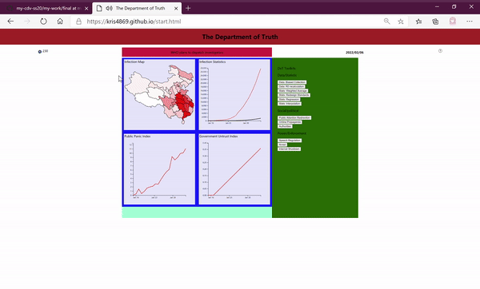

##The Department of Truth

#### Description

This project is a "game of data visualization". In The course we understand that data is never raw, nor reflecting the whole truth of whatever stories. People, companies and governments manipulate the big data to affect the behavior of the public. Therefore, inspired by the book 1984, where the officers in the "department of truth" change the data to change history and present, we use the current corona virus as a model to build this game. In the game the player will try to control the society by using tools to manipulate data and it relevant characters.

  

#### Sources:  
https://www.kaggle.com/allen-institute-for-ai/CORD-19-research-challenge
